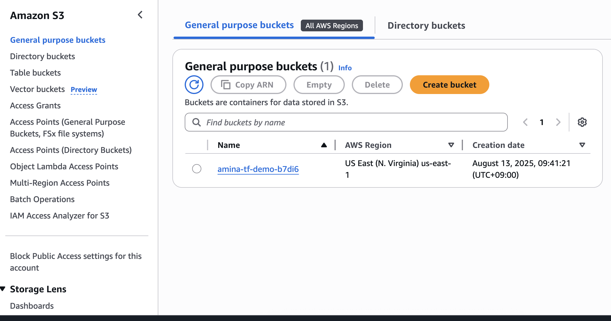
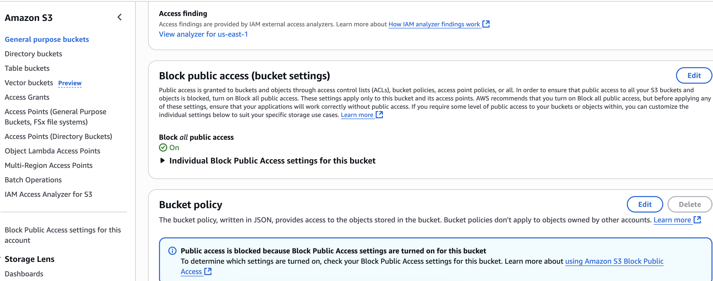
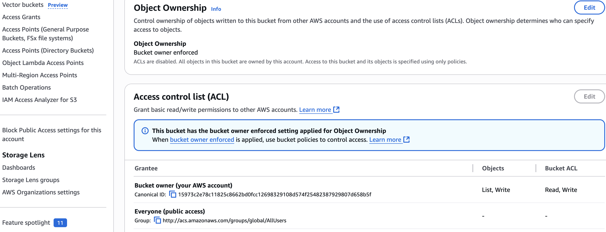
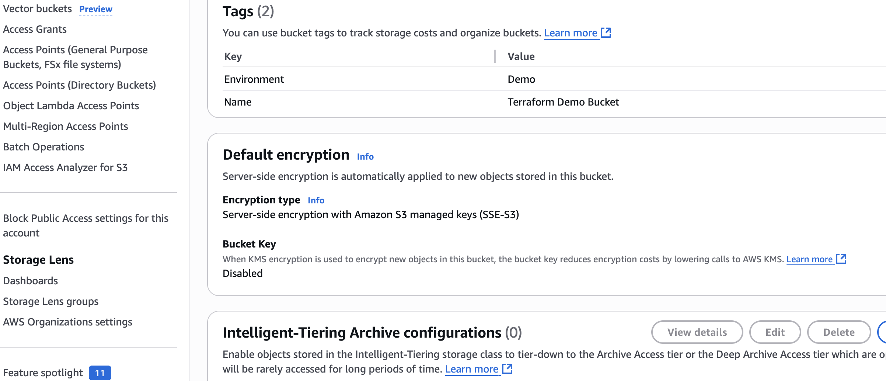

# Terraform S3 (us-east-1): Secure Private Bucket Deployment

This project provisions a **secure, private Amazon S3 bucket** in the **us-east-1** region using Terraform.  
It follows AWS security best practices to ensure the bucket is secure by default and is part of my cloud security portfolio.


##  Overview
The Terraform configuration creates:
- **Private S3 bucket** with globally unique name
- **Bucket Owner Enforced** mode (ACLs disabled)
- **Full Public Access Block** (all four settings enabled)
- **Tagged resources** for environment clarity
- **Random lowercase suffix** to avoid name collisions


##  Security Considerations
- **ACLs Disabled** → Prevents legacy, overly permissive access paths.
- **Public Access Block** → Eliminates the risk of accidental public exposure.
- **Deterministic tagging** → Improves governance and cost tracking.
- **Region-specific deployment** → Demonstrates deployment in the Seoul region.


## Prerequisites
- Terraform installed (`terraform -version`)
- AWS account with S3 permissions
- AWS credentials configured via:
  - `AWS_PROFILE`  
  **or**
  - `AWS_ACCESS_KEY_ID` / `AWS_SECRET_ACCESS_KEY`
- Default region in `provider "aws"`: `us-east-1`


## Deployment
```bash
terraform init
terraform fmt && terraform validate
terraform plan
terraform apply

** Example output after successful apply:**

```
Outputs:

bucket_name = "amina-tf-demo-b7di6"


## Screenshots (Verification in AWS Console)

| Screenshot | Description |
|------------|-------------|
|  | **Buckets list** showing the newly created bucket |
|  | **Permissions tab** showing Block Public Access is enabled |
|  | **Ownership settings** showing Bucket Owner Enforced (ACLs disabled) |
|  | **Properties tab** showing bucket details in us-east-1 |


## ✍️ Author Notes
This project is part of my **Cloud Security & Compliance Portfolio**, showcasing secure-by-default infrastructure provisioning with Terraform.  
It demonstrates the importance of **least privilege**, secure defaults, and infrastructure-as-code repeatability for AWS resources.

